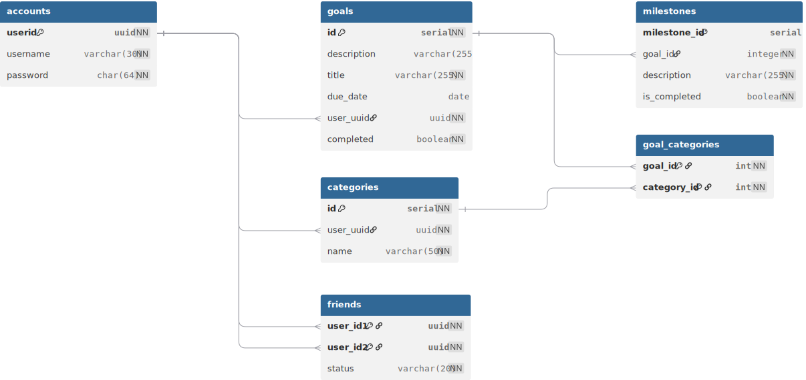

# Gon (Goal Tracker App)

**Gon** is a mobile application developed as a joint project for **COMS2013A & COMS2002A** (Second Year Computer Science). The application focuses on personal goal management and utilizes remote database mechanics to synchronize data.

## Members
* Damian Nel
* Gabriela Fernandes
* Nickson He
* Raymond Gordon

## Theme
Personal productivity and goal tracking. The app provides a centralized platform for users to define, track, and manage their objectives along with friends!

## Features
* **Secure Authentication**: User login system featuring SHA-256 password hashing for secure data transmission.
* **Goal Dashboard**: A clean interface to view all active goals, milestones and maybe a chance to interact with friends
* **Cloud Sync**: Real-time interaction with a remote PHP/PostgreSQL backend via `OkHttp` to ensure data is stored safely off-device this does unfortunately require the user to be offline.

## Tech Stack
* **Frontend**: Java (Android SDK)
* **UI/UX**: Material Components (RecyclerView, FloatingActionButton, CardView)
* **Networking**: OkHttp 3
* **Backend**: PHP, PostrgreSQL
* **Security**: SHA-256 Hashing

## Database Design

